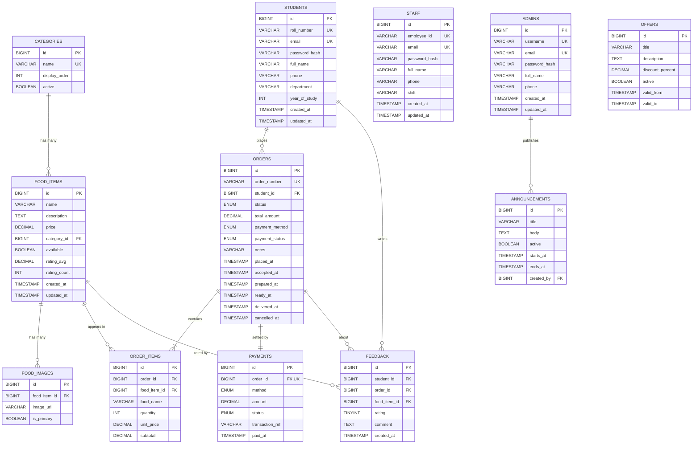

# LBRCE Canteen Management System — ER Diagram

Below is a Mermaid diagram of the database schema. View it on GitHub or in any Markdown preview that supports Mermaid.

## Cardinality summary

| Relationship | Cardinality |
|---|---|
| Categories → FoodItems | 1 : N |
| FoodItems → FoodImages | 1 : N |
| Students → Orders | 1 : N |
| Orders → OrderItems | 1 : N (cascade delete) |
| Orders → Payments | 1 : 1 (one payment per order) |
| Students → Feedback | 1 : N |
| Orders → Feedback | 1 : N (optional) |
| FoodItems → Feedback | 1 : N (optional) |
| Admins → Announcements | 1 : N (optional) |